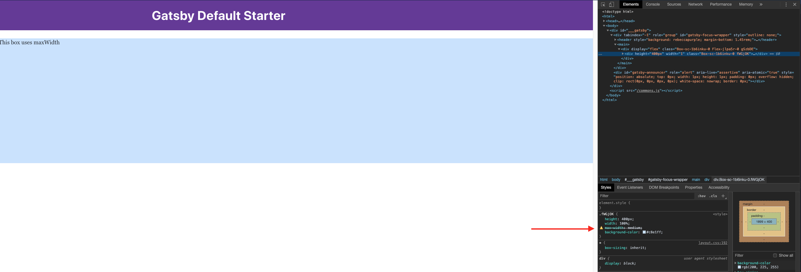
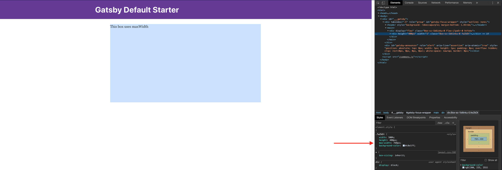

## Running project
### 1. Install dependencies

In the directory, run:
```shell
npm install
gatsby develop
```

### 2. Localhost
The site should be running on http://localhost:8000,  
or if it's already in use, enter `y` when prompted to run on another port.

## Issue
### Version
The issue starts happening in `@primer/components` version `13.1.0`, the issue is not present in version `13.0.0`. The issue is still present in the latest version, `16.0.0`.

Version `13.1.0` included an upgrade to Styled System v5. Maybe this has something to do with this [changelog item](https://github.com/styled-system/styled-system/blob/master/CHANGELOG.md#v500-2019-06-02):
>The new theme.sizes scale replaces heights, minHeights, maxHeights, minWidths, and maxWidths; and is used for the width prop

### Description
The `maxWidth` property from the `styled-system` LAYOUT props does not translate the received `maxWidths` theme key into the its value.

With version `13.0.0`, using `maxWidth` with a theme size like `medium` will correctly translate into its pixel value, `768px`.

In versions `13.1.0` and up, `maxWidth` no longer translates the theme's `maxWidths` keys into its pixel value. In Chrome DevTools, you can see the `maxWidths` key string `'medium'` is used in the CSS instead of the key's value.

You can see the `maxWidths` values which are apart of primer's theme here: https://github.com/primer/components/blob/master/src/theme.js#L163

Using a string for a literal CSS value still works. E.g., `maxWidth="200px"`.

## Preview
### 1. maxWidth issue.

@primer/components version: `13.1.0` and up

maxWidth prop can't use theme values such as `medium`.



### 2. maxWidth working as expected.

@primer/components version: `13.0.0`

maxWidth prop can use theme values such as `medium`.


