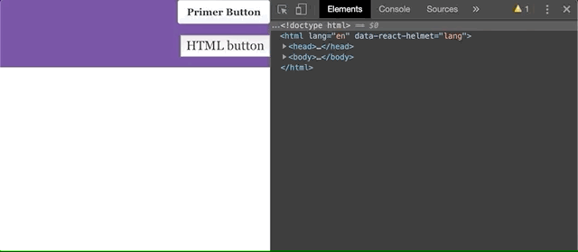

## Running project
### 1. Install dependencies

In the directory, run:
```shell
npm install
gatsby develop
```

### 2. Localhost
The site should be running on http://localhost:8000

## Issue
The issue starts happening in @primer/components version 13.2.0, the issue is not present in version 13.1.0. The issue is still present in the latest version, 16.0.0.

When the Button component is clicked, the button element disappears behind all other elements. The z-index (highest on page) is unchanged in CSS, so looks like a rendering bug.

Clicking another time brings the element forward again; even clicking in the developer tools window, outside of the rendered view.

When menu opens, click events on the button are ignored until the menu is moved out of view. The menu has a z-index lower than the button, but it appears to be blocking the click events.

## Preview
### 1. Button component issue.

@primer/components version: `13.2.0`

Button component disappears behind other elements and click events are ignored.


### 2. Button component working as expected.

@primer/components version: `13.1.0`

Button component stays on top of menu and click events are captured.


